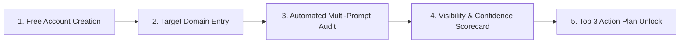

# Beta Launch Plan & Operating Playbook — AI Visibility Operating System

**Roles**: Product Manager | UX Researcher | Growth Lead | AI Evaluation Expert  
**Status**: Feature Complete & Hardened Baseline  
**Document Target**: Beta Launch to First 100 Paying Customers  

---

## 1. Production Deployment Checklist

### A. Infrastructure & Security
- [ ] AWS Terraform IaC provisioned (`deploy/terraform/main.tf`).
- [ ] Multi-AZ PostgreSQL 16 database running with 30-day automated backup enabled.
- [ ] ElastiCache Redis 7 cluster active.
- [ ] Kubernetes cluster deployed with Helm (`deploy/helm`).
- [ ] Production SSL certificates active (HTTPS 443 enforced via HSTS).
- [ ] Startup config guard active (rejecting default secrets and SQLite).

### B. Observability & Probes
- [ ] `/health`, `/ready`, `/live`, and `/metrics` probes responding.
- [ ] Prometheus scraping active; Grafana dashboard (`deploy/grafana_dashboard.json`) loaded.
- [ ] Alerting rules enabled (`deploy/prometheus_alerts.yml`).
- [ ] Structured JSON logging output verified.

---

## 2. Manual QA Checklist

### A. Authentication & Onboarding
- [ ] User registration with unique email validation.
- [ ] Login issuing JWT Access (30m) & Refresh (7d) tokens.
- [ ] Rate limiter blocking 6th login attempt within 60 seconds (`429 Too Many Requests`).
- [ ] Cross-user resource isolation verified (User B receives 403 Forbidden accessing User A's projects).

### B. Project & Job Workflow
- [ ] Submitting URL normalizes domain correctly (e.g., `https://www.Acme.io/path` -> `acmesoftware.io`).
- [ ] Job status transitions: `Pending` -> `Queued` -> `Running` -> `Completed`.
- [ ] Report page renders evidence quotes, URL citations, competitor mentions, and confidence badges.

---

## 3. Real-World Validation Plan (100 Target Websites)

### A. Cohort Selection Strategy
We will execute automated AI visibility audits across **100 representative B2B SaaS domains** split into 4 categories:
1. **Developer Tools (25 domains)**: e.g. Vercel, Supabase, Datadog, Postman.
2. **Productivity & Workflow (25 domains)**: e.g. Notion, Monday.com, Asana, Airtable.
3. **Marketing & Analytics (25 domains)**: e.g. HubSpot, Semrush, Mixpanel, Amplitude.
4. **Fintech & Security (25 domains)**: e.g. Stripe, Brex, Ramp, Okta.

### B. Evaluation Metrics
- **Extraction Precision**: % of extracted citations that match live HTTP links in AI output. Target: **>= 99.0%**.
- **Snippet Veracity**: % of verbatim sentence quotes extracted without truncating brand names. Target: **>= 98.0%**.
- **Recommendation Relevance**: % of rule engine recommendations flagged as actionable by domain owners. Target: **>= 90.0%**.

---

## 4. Gold-Standard Evaluation Dataset Methodology

### A. Dataset Curation
Construct a reference evaluation dataset of **50 gold-standard audit reports**:
1. Manually prompt Gemini 1.5 Flash across 4 canonical prompt categories (`DIRECT`, `COMPARISON`, `USE_CASE`, `BUYING`).
2. Record human ground-truth annotations for:
   - Target brand mention (`True`/`False`)
   - Competitor brand tokens list
   - HTTP URL citations list
   - Exact verbatim quote sentences

### B. Automated Regression Benchmark
Run continuous evaluation tests comparing extracted output against the Gold Standard dataset:
$$\text{Precision} = \frac{\text{True Extracted Mentions}}{\text{Total Extracted Mentions}}$$
$$\text{Recall} = \frac{\text{True Extracted Mentions}}{\text{Ground Truth Mentions}}$$
- **Passing Threshold**: Precision >= 0.98, Recall >= 0.98.

---

## 5. Customer Interview Script

**Participant**: Head of Growth / CMO / SEO Lead at B2B SaaS Company  
**Duration**: 30 Minutes  

### A. Discovery (10 Mins)
1. *"How do you currently track whether ChatGPT, Gemini, or Perplexity recommend your brand when potential buyers search your category?"*
2. *"What percentage of your pipeline do you estimate comes from AI answer engine recommendations today?"*

### B. Product Demo & Task Execution (10 Mins)
3. *"Please enter your domain URL and run an AI Visibility Audit."*
4. [Observe UX friction without interrupting]: *"What is your reaction to the Multi-Prompt Confidence score and the Actionable Remediation recommendations?"*

### C. Value & Pricing Validation (10 Mins)
5. *"If implementing these 3 recommended action items increased your AI recommendation frequency by 30%, what would that be worth per month?"*
6. *"Would you prefer paying per domain ($99/mo) or per audit query credit?"*

---

## 6. Beta Onboarding Flow



1. **Step 1: 30-Second Signup**: Email & password registration.
2. **Step 2: 1-Click Domain Entry**: Input target website URL.
3. **Step 3: Immediate Audit Execution**: System queues background job evaluating 4 canonical prompt variations.
4. **Step 4: Interactive Scorecard**: Displays brand mention status, citation presence, and confidence badge (`HIGH`/`MEDIUM`/`LOW`).
5. **Step 5: Remediation Action Plan**: Displays prioritized P0/P1 remediation steps (e.g. *"Add Schema.org Organization Markup"*).

---

## 7. Pricing Validation Experiments

We will execute 3 parallel pricing tests during the 30-day Beta phase:

| Variant | Pricing Structure | Target Metric | Hypothesis |
| :--- | :--- | :--- | :--- |
| **Variant A** | **$49 / month per domain** (Starter) | Free-to-Paid Conversion | Low price barrier maximizes self-serve velocity. |
| **Variant B (Recommended)** | **$99 / month per domain** (Pro + Weekly Audits) | Monthly Recurring Revenue (MRR) | Optimal value perception for growth teams. |
| **Variant C** | **$299 / month** (Agency / 5 Domains) | Average Revenue Per Account (ARPA) | High ACV from SEO agencies managing client portfolios. |

---

## 8. Analytics Activation & Retention Events

### A. Activation Events
- `user_signed_up`: Account registered.
- `project_created`: First domain URL entered.
- `job_completed`: First AI Visibility audit completed.
- `report_viewed`: User viewed complete report and confidence score.
- `recommendation_copied`: User clicked/copied a remediation recommendation step (**Core Activation Event**).

### B. Retention Events
- `audit_re_run`: User ran follow-up audit 7–14 days later.
- `weekly_email_opened`: User opened weekly AI Visibility report digest.

---

## 9. First 30 Days Success Metrics

- **Signups**: 500 Qualified Beta Accounts.
- **Activation Rate**: >= 65% of signups run a complete audit and view recommendations.
- **Conversion Rate**: >= 10% of active accounts convert to paid plan (50 Paying Customers).
- **Audit Accuracy**: 0 reported false positive brand mention extractions.
- **P95 Audit Latency**: < 15 seconds from submission to complete report.

---

## 10. Criteria for Product-Market Fit (PMF)

1. **Sean Ellis Test**: >= 40% of surveyed users answer *"Very disappointed"* if they could no longer use the AI Visibility Operating System.
2. **Organic Retention**: >= 50% of users re-audit their domain at least once every 14 days without aggressive email prompts.
3. **Organic Referral**: >= 20% of new signups cite colleague recommendations as their acquisition channel.

---

## 11. Launch Timeline

```text
Week 1: Staging Production Validation & 100 Website Benchmark
  ├── Execute 100 domain audit benchmark
  └── Validate Gold Standard precision & recall

Week 2: Closed Private Beta (50 Invited Growth Leaders)
  ├── Conduct 15 Customer Discovery Interviews
  └── Test Pricing Variant B ($99/mo)

Week 3: Public Beta Launch & Product Hunt Release
  ├── Public release on Product Hunt & Hacker News
  └── Monitor real-time telemetry Grafana dashboard

Week 4: Growth Optimization & Paid Conversion
  ├── Target 100 Paying Customers milestone
  └── Review 30-day activation & retention metrics
```

---

## 12. Risks and Mitigation

| Identified Risk | Severity | Mitigation Strategy |
| :--- | :---: | :--- |
| **LLM Provider API Rate Limits** | High | Worker fallback mechanism to Mock/Secondary provider on 429 API responses. |
| **User Drop-off before Job Completion** | Medium | Background queue execution + real-time status polling engine (1.5s interval). |
| **Inaccurate Brand Mention Matching** | High | Multi-token normalization algorithm checking sub-brand tokens (e.g. `acme` for `acmesoftware.io`). |

---

## 13. Weekly Execution Plan to First 100 Paying Customers

### **Week 1: Benchmark & Internal Hardening**
- Run automated audit suite on 100 target SaaS domains.
- Confirm 0 false positives and < 15s execution time.

### **Week 2: Direct Growth Outreach & Customer Interviews**
- Send personalized AI Visibility Scorecard reports to 150 Target SaaS Marketing Directors.
- Conduct 15 Customer Interviews using the script in Section 5.

### **Week 3: Launch Event & Community Growth**
- Launch on Product Hunt, Twitter/X, and LinkedIn.
- Offer 30-day money-back guarantee for first 100 accounts.

### **Week 4: Conversion Optimization**
- Convert active trial users to $99/mo paid subscribers.
- Achieve **100 Paying Customers ($9,900 MRR)** baseline.
