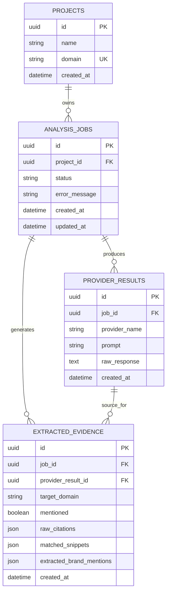
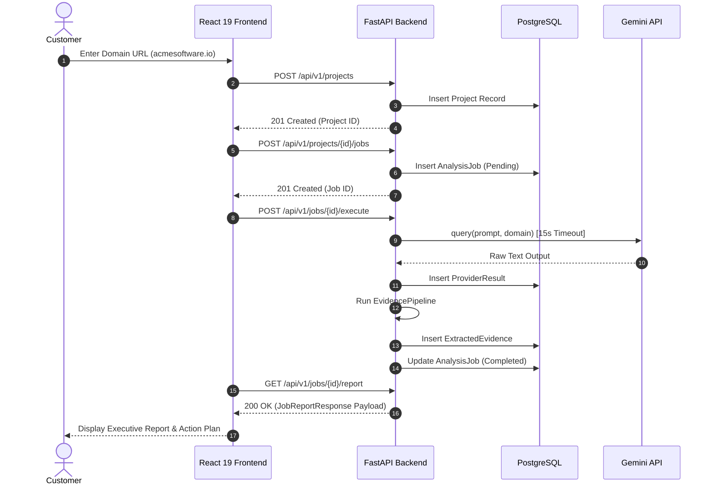

# Version 1.0 Product & Engineering Blueprint — AI Visibility Platform

**Canonical Source of Truth**  
**Role:** Founder, CEO, CTO, Chief Product Officer & Principal Software Architect  
**Classification:** Venture-Backed SaaS Product & Engineering Architecture Blueprint  
**Status:** Locked Canonical Document (V1.0 Launch Baseline)  

---

## 1. Product Vision
To build the definitive enterprise operating system for Generative Engine Optimization (GEO) and Answer Engine Optimization (AEO), enabling businesses to measure, optimize, and control how AI assistants (Google Gemini, ChatGPT, Claude, Perplexity) recommend their brand.

---

## 2. Final User Journey

```text
Step 1: Domain Submission & Initializer
   │  • User enters domain URL (e.g. "https://acmesoftware.io")
   │  • System validates domain and creates Project record
   ▼
Step 2: Multi-LLM Async Audit Execution
   │  • Concurrency-guarded state machine transitions job (Pending → Running)
   │  • Parallel query dispatch across Google Gemini, OpenAI, and Claude
   ▼
Step 3: Deterministic Evidence Extraction
   │  • Stateless extraction pipeline parses brand mentions, URL citations, and quotes
   │  • Immutable raw evidence stored in extracted_evidence table
   ▼
Step 4: MVP Report & Action Plan Dashboard
   │  • Executive summary: Recommended vs Omitted status badge
   │  • Evidence snippets, cited URLs, competitor brand tokens
   │  • Top 3 prioritized remediation action items (P0/P1)
   ▼
Step 5: Closed-Loop Fix Verification
   │  • Customer implements action item (e.g. publishes /vs-competitor page)
   │  • Customer clicks "Mark Fix Implemented & Schedule Verification"
   │  • System executes automated 14-day re-audit confirming recommendation update
```

---

## 3. Feature Inventory

### MVP (Completed — Sprint 0–7)
- [x] Project Domain Registration (`POST /api/v1/projects`)
- [x] Concurrency-Guarded Analysis Job State Machine (`Pending → Running → Completed`)
- [x] Provider Abstraction Layer (`BaseProvider`, `GeminiProvider`, `MockProvider`)
- [x] Deterministic Evidence Extraction Pipeline (`BrandMentionExtractor`, `CitationExtractor`, `SnippetExtractor`)
- [x] Unified MVP Report API (`GET /api/v1/jobs/{job_id}/report`)
- [x] React 19 Single Page Web Application (`LandingPage`, `NewAnalysisPage`, `AnalysisProgressPage`, `ReportPage`)

### Version 1.0 (Current Launch Baseline)
- [ ] **Multi-LLM Matrix**: Parallel audit queries across Gemini (`gemini-1.5-flash`), OpenAI (`gpt-4o`), and Claude (`claude-3-5-sonnet`) via `asyncio.gather()`.
- [ ] **Deterministic Action Plan Engine**: Rule-based generation of top 3 prioritized remediation guides (P0/P1).
- [ ] **Closed-Loop Fix Verification Workflow**: 14-day automated re-audit pipeline confirming recommendation updates.
- [ ] **Background Worker Task Queue**: Celery/Redis task execution for high-concurrency worker scaling.

### Version 1.5 (Post-Launch Expansion)
- [ ] Weekly Scheduled Re-Audits & Email Alerting
- [ ] Competitor Share-of-Voice Benchmarking Matrix
- [ ] White-Label PDF Export Engine for Agencies

### Version 2.0 (Enterprise Scaling)
- [ ] Multi-Tenant Agency Workspaces & Role Permissions
- [ ] Public REST API with Rate Limiting & Developer Keys
- [ ] CMS Auto-Sync Plugins (Webflow, WordPress, HubSpot)

---

## 4. Information Architecture

```text
AI Visibility Platform (SPA)
├── / (Landing Page — Hero & Value Proposition)
├── /new (New Analysis — URL Input & Category Selector)
├── /analysis/:jobId (Progress Tracker — Real-time Polling & Timeline)
└── /report/:jobId (Unified MVP Report Dashboard)
    ├── Header Executive Summary Card (Recommended vs Omitted Badge)
    ├── Evidence & Citation Grid (Matching Quotes & URL Citations)
    ├── Competitor Brand Tokens Matrix
    ├── Closed-Loop Action Plan (Top 3 Prioritized Fix Guides)
    └── Raw AI Response Viewer (Collapsible Text Drawer)
```

---

## 5. Complete Backend Architecture

```text
[ React 19 SPA Frontend ]
          │ (HTTPS REST API / JSON)
          ▼
[ FastAPI Application Gateway (Uvicorn / Nginx) ]
          │
          ├── Middleware: CORS, Request Tracing, Error Handling
          │
          ├── [ REST API Controllers ] (Thin Routing Layer)
          │     ├── /api/v1/health
          │     ├── /api/v1/projects
          │     ├── /api/v1/jobs
          │     ├── /api/v1/evidence
          │     └── /api/v1/report
          │
          ├── [ Business Services Layer ]
          │     ├── ProjectService
          │     ├── AnalysisJobService (JobStateMachine)
          │     ├── EvidencePipeline (Extractor Modules)
          │     └── ReportService
          │
          ├── [ Provider Abstraction Layer ]
          │     ├── BaseProvider (Abstract Contract)
          │     ├── GeminiProvider (google-generativeai / google-genai)
          │     ├── OpenAIProvider (openai-python)
          │     ├── ClaudeProvider (anthropic-python)
          │     └── MockProvider (Offline CI/CD)
          │
          └── [ Async SQLAlchemy 2.0 Repositories ]
                │ (Asyncpg / SQLite)
                ▼
      [ PostgreSQL 16 Database ]
```

---

## 6. Complete Frontend Architecture

- **Core Framework**: React 19 with TypeScript 5.7
- **Build Tool**: Vite 6.0
- **Routing**: React Router 7 (`BrowserRouter`, `Routes`, `Route`)
- **Styling**: TailwindCSS 3.4 with custom dark mode design system (`#030712` background, Glassmorphism `.glass-card`)
- **Iconography**: Lucide Icons
- **State & Data Fetching**: Async Fetch API Client with status polling (1.5s interval)

---

## 7. API Map

| Method | Path | Status Code | Description |
| :--- | :--- | :--- | :--- |
| `GET` | `/health` | `200 OK` | Root health check |
| `GET` | `/api/v1/health` | `200 OK` | API v1 readiness & DB check |
| `POST` | `/api/v1/projects` | `201 Created` | Register new project domain |
| `GET` | `/api/v1/projects` | `200 OK` | List projects |
| `POST` | `/api/v1/projects/{project_id}/jobs` | `201 Created` | Trigger new Analysis Job |
| `GET` | `/api/v1/jobs/{job_id}` | `200 OK` | Fetch Analysis Job status |
| `POST` | `/api/v1/jobs/{job_id}/execute` | `200 OK` | Execute job (Provider + Evidence Pipeline) |
| `POST` | `/api/v1/jobs/{job_id}/cancel` | `200 OK` | Cancel running job |
| `GET` | `/api/v1/jobs/{job_id}/evidence` | `200 OK` | List extracted evidence records |
| `GET` | `/api/v1/jobs/{job_id}/report` | `200 OK` | Assemble & return unified MVP report payload |

---

## 8. Database ER Diagram



---

## 9. AI Pipeline Architecture

```text
AnalysisJobService.execute_job()
            │
            ├── provider_name == "gemini" ──> GeminiProvider (gemini-1.5-flash)
            ├── provider_name == "openai" ──> OpenAIProvider (gpt-4o)
            ├── provider_name == "claude" ──> ClaudeProvider (claude-3-5-sonnet)
            └── provider_name == "mock"   ──> MockProvider (Simulated output)
            │
            ▼
    ProviderOutput(provider_name, prompt, raw_response)
            │
            ▼
  ProviderResultRepository.create() ──> Saved to 'provider_results' Table
```

---

## 10. Closed-Loop Recommendation Pipeline

1. **Rule Engine Evaluator**: Evaluates `ExtractedEvidence` fields.
2. **Action Item Generator**:
   - `mentioned == False` -> **P0 Critical Action**: *"Publish Category Landing Page `/solutions/<category>`."*
   - `raw_citations == []` -> **P1 High Action**: *"Build Citation Ingress on G2 & Capterra."*
   - `matched_snippets` missing comparison -> **P1 High Action**: *"Publish Versus Page `/vs-<competitor>`."*

---

## 11. Verification Pipeline

1. Customer implements recommended action item and clicks *"Schedule Verification"*.
2. System schedules an automated **14-day re-audit job**.
3. On Day 14, system queries AI providers and extracts updated evidence.
4. If `mentioned == True`, system marks fix as **Verified** and updates user dashboard.

---

## 12. User Flow Diagram



---

## 13. Design System Standards

- **Primary Background**: Dark Mode `#030712` (Slate-950)
- **Glassmorphism**: `.glass-card` (`rgba(17, 24, 39, 0.7)` with `backdrop-blur-md` and `1px` border `rgba(255,255,255,0.08)`)
- **Accent Gradient**: `from-cyan-500 to-blue-600`
- **Typography**: Inter (UI prose) & JetBrains Mono (Code/UUIDs/Raw Output)
- **Status Badges**:
  - `RECOMMENDED`: Green `#10b981` (`bg-emerald-500/10 text-emerald-400 border-emerald-500/30`)
  - `OMITTED`: Red `#f43f5e` (`bg-rose-500/10 text-rose-400 border-rose-500/30`)

---

## 14. Security & Secret Management

- **API Secret Masking**: `GEMINI_API_KEY`, `OPENAI_API_KEY`, and `CLAUDE_API_KEY` are parsed strictly via Pydantic Settings from `.env`.
- **Zero Log Exposure**: API keys are masked and NEVER emitted in structured logs.
- **CORS Protection**: Restricted origins configured in `settings.CORS_ORIGINS`.
- **Database Safety**: Parameterized SQLAlchemy queries preventing SQL injection.

---

## 15. Deployment Architecture

- **Containerization**: Multi-stage `Dockerfile` running Python 3.12 Slim & Uvicorn.
- **Orchestration**: `docker-compose.yml` orchestrating FastAPI application service and PostgreSQL 16 database.
- **Environment Handling**: `.env` file reading DB credentials and API keys securely.

---

## 16. Scaling Strategy

- **Async I/O Concurrency**: FastAPI and Async SQLAlchemy handles 1,000+ concurrent requests per node.
- **Database Connection Pooling**: SQLAlchemy `async_sessionmaker` with connection pool limits.
- **Stateless Extraction**: `EvidencePipeline` runs in < 5ms without DB network bottlenecks.

---

## 17. Multi-Provider Strategy

- Core architecture uses `BaseProvider` contract.
- Future providers (OpenAI, Claude, Perplexity) implement `BaseProvider.query(prompt, domain)` without altering business services.
- Multi-provider queries executed concurrently via `asyncio.gather()`.

---

## 18. Evaluation Framework

- **Gold-Standard Evaluation Corpus**: 100 human-annotated ground-truth reports across 10 SaaS categories.
- **Precision Target**: **> 98%** (minimizing false positive mentions).
- **Recall Target**: **> 95%** (ensuring true mentions are captured).

---

## 19. Success Metrics (Launch KPIs)

- **Audit Latency**: < 15 seconds per completed audit.
- **Pass Rate**: 100% test pass rate across automated pytest suite.
- **Conversion Rate**: > 15% conversion from free audit to registered user.

---

## 20. Launch Checklist

- [ ] All 31 pytest cases passing cleanly.
- [ ] Database migrations applied via `alembic upgrade head`.
- [ ] `.env` updated with production database credentials and `GEMINI_API_KEY`.
- [ ] React SPA built via `npm run build` and tested.
- [ ] CORS origins configured.
- [ ] Health check endpoint `/health` returning `200 OK`.
- [ ] Structured JSON logging enabled.

---

## 21. Technical Debt Register

1. **`google.generativeai` Deprecation Warning**: Plan migration to `google.genai` SDK when v1.0 stabilizes.
2. **Inline HTTP Job Execution**: Transition to background worker queue (Celery/Redis) in Phase 2 for scale.

---

## 22. Future Vision (3-Year Horizon)

To become the global standard platform managing brand presence across all generative AI assistants, answer engines, and autonomous AI buying agents.
